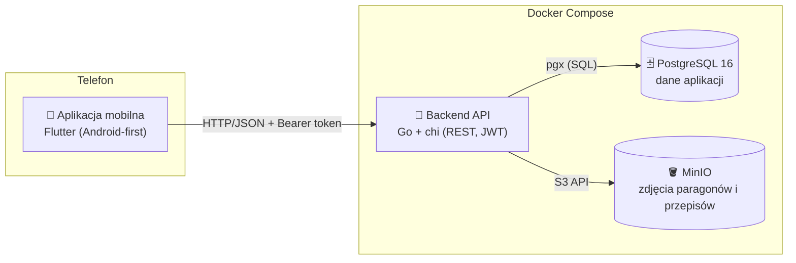

# Ogarniaczka 🏡💗

**Jedna apka zamiast pięćdziesięciu** - domowy organizer do prowadzenia siebie i domu:
notatki, przypomnienia, kalendarz i plan tygodnia, obowiązki do odhaczania, przepisy
i pomysły na obiad, dzienniczek żywieniowy oraz budżet domowy ze zdjęciami paragonów.

## Funkcjonalności (MVP)

| Moduł | Co robi |
|---|---|
| 📝 **Notatki** | szybkie notatki z przypinaniem ważnych na górę |
| 🔔 **Przypomnienia** | "umów przegląd", "kup prezent" - z datą i godziną, do odhaczenia |
| 📅 **Kalendarz + plan tygodnia** | wydarzenia z godziną lub całodniowe; widok tygodnia łączy wydarzenia, obowiązki i jadłospis |
| ✅ **Obowiązki** | do odhaczenia; powtarzalne (codziennie / co tydzień / co miesiąc) same planują kolejny termin po odhaczeniu |
| 👩‍🍳 **Przepisy** | składniki, kroki, tagi, czas, zdjęcie, ulubione + **losowanie pomysłu na obiad** 🎲 |
| 🍽️ **Jadłospis** | planowanie posiłków na konkretne dni (przepis z bazy albo dowolny wpis) |
| 🥗 **Dzienniczek żywieniowy** | co zjadłam + kalorie, suma dzienna |
| 💰 **Budżet domowy** | wydatki/przychody, kategorie, limity miesięczne z paskami postępu, **zdjęcia paragonów** (aparat/galeria) |
| 👤 **Konta** | rejestracja/logowanie (JWT), każdy użytkownik widzi tylko swoje dane |

## Architektura



Decyzje projektowe:

- **REST + JSON** - prosto, przewidywalnie, łatwo dodać kolejne klienty (web).
- **JWT (30 dni)** - bezstanowy backend, token trzymany w aplikacji.
- **Kwoty w groszach (`BIGINT`)** - zero problemów z zaokrągleniami float.
- **Pliki przez backend** (`POST /api/files` → MinIO, `GET /api/files/{id}` streamuje z powrotem) -
  telefon nie musi znać adresu MinIO, a dostęp do zdjęć jest autoryzowany per użytkownik.
- **Migracje SQL wbudowane w binarkę** - backend sam migruje bazę przy starcie, bez dodatkowych narzędzi.
- **Wszystkie tabele mają `user_id`** - izolacja danych na poziomie każdego zapytania.

## Struktura repozytorium

```
├── docker-compose.yml        # postgres + minio + backend
├── .env.example              # konfiguracja (skopiuj do .env)
├── backend/                  # Go 1.24
│   ├── cmd/server/           # main: config → db+migracje → minio → HTTP
│   └── internal/
│       ├── config/           # zmienne środowiskowe
│       ├── database/         # pgxpool + migracje (embed)
│       ├── storage/          # klient MinIO (bucket, put/get)
│       └── httpapi/          # router chi + handlery per moduł
│           auth, notes, reminders, events, tasks,
│           recipes, mealplan, diary, budget, files
└── mobile/                   # Flutter (Dart), Material 3
    └── lib/
        ├── api/              # klient HTTP (JWT, upload plików)
        ├── models/           # modele danych
        ├── screens/          # Dziś, Tydzień, Kuchnia, Budżet, Notatki, ...
        └── dialogs.dart      # wspólne dialogi dodawania/edycji
```

## Model danych

`users` → posiada: `notes`, `reminders`, `events`, `tasks` (z `repeat`),
`recipes` (tagi `TEXT[]`, opcjonalne zdjęcie), `meal_plan` (unikat na dzień+posiłek,
FK do przepisu), `diary_entries`, `budgets` (limit na miesiąc+kategorię),
`transactions` (wydatek/przychód, opcjonalny FK do paragonu), `files` (metadane obiektów w MinIO).

## API (skrót)

| Endpoint | Opis |
|---|---|
| `POST /api/auth/register`, `POST /api/auth/login` | konto + token JWT |
| `GET/POST/PUT/DELETE /api/notes[/{id}]` | notatki |
| `... /api/reminders[/{id}]` + `POST .../toggle` | przypomnienia |
| `... /api/events[/{id}]` (`?from=&to=`) | kalendarz |
| `... /api/tasks[/{id}]` + `POST .../toggle` (`?dueFrom=&dueTo=&includeDone=`) | obowiązki (toggle powtarzalnego tworzy następne wystąpienie) |
| `... /api/recipes[/{id}]`, `GET /api/recipes/random?tag=` | przepisy + losowanie obiadu |
| `GET/PUT /api/mealplan`, `DELETE /api/mealplan/{id}` | jadłospis (upsert na dzień+posiłek) |
| `... /api/diary[/{id}]` (`?from=&to=`) | dzienniczek |
| `GET /api/budget/summary?month=`, `PUT /api/budget/limits` | podsumowanie miesiąca + limity |
| `... /api/transactions[/{id}]` (`?month=`) | transakcje |
| `POST /api/files` (multipart), `GET /api/files/{id}` | zdjęcia (MinIO) |
| `GET /healthz` | status serwera |

Wszystkie endpointy poza `auth` i `healthz` wymagają nagłówka `Authorization: Bearer <token>`.
Komunikaty błędów API są po polsku - aplikacja pokazuje je wprost użytkowniczce.

## Jak uruchomić

### 1. Backend (Docker)

```bash
cp .env.example .env          # opcjonalnie: zmień hasła i JWT_SECRET
docker compose up -d --build
```

- API: `http://localhost:8080` (health-check: `http://localhost:8080/healthz`)
- Konsola MinIO: `http://localhost:9001` (login/hasło z `.env`, domyślnie `minioadmin`/`minioadmin`)
- Postgres: `localhost:5432`

Backend sam czeka na bazę, wykonuje migracje i zakłada bucket w MinIO.

### 2. Aplikacja mobilna (Android)

Wymagany [Flutter SDK](https://docs.flutter.dev/get-started/install). Szczegóły w [`mobile/README.md`](mobile/README.md), w skrócie:

```bash
cd mobile
flutter create --project-name ogarniaczka --org pl.apka --platforms android .
# dev po HTTP: dodaj android:usesCleartextTraffic="true" do <application> w
# android/app/src/main/AndroidManifest.xml
flutter run
```

Adres serwera ustawisz w apce (ikona ⚙️, dostępna też przed zalogowaniem):
- emulator Androida: `http://10.0.2.2:8080` (domyślny),
- prawdziwy telefon: `http://<IP-komputera>:8080` w tej samej sieci Wi-Fi.

### Testy

Skrypt dymny przechodzi całe API (33 asercje: auth, CRUD-y wszystkich modułów,
powtarzalne obowiązki, upload/pobranie paragonu, izolacja użytkowników) - wymaga
uruchomionego backendu.

## Roadmapa (po MVP)

- 🔔 push-notyfikacje przypomnień (FCM) + lokalne powiadomienia
- 👨‍👩‍👧 konto domowe - współdzielenie list i budżetu z domownikami
- 🧾 OCR paragonów (automatyczne kwoty i kategorie)
- 📈 wykresy budżetu i trendów, eksport CSV
- 📴 tryb offline z synchronizacją
- 🍎 build na iOS (Flutter - ten sam kod)
